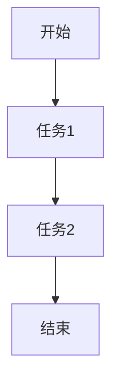
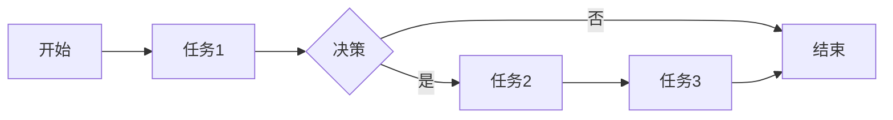

 ## 1.typora基本使用（mac快捷方式）

#### 2.纯文本形式粘贴 （在mac中为command+option+v）

#### 3.划线

###### 3.1分隔符（option+command+-）

------

###### 3.2中划线（control+shift+`)【这个好困难好难打】

~~爱意随风起，风止意难平~~

###### 3.3下划线（command+u)

<u>追风赶月莫停留，平芜尽处是春山</u>

#### 4.列表

###### 4.1有序列表（option+command+O）

1. You always say what I need to hear
2. You mean the world to me.

###### 4.2无序列表（option+command+U）

- You are my theme for a dream
- Meeting you is the beginning of the story, and walking away is the joy of the rest of my life

###### 4.3减少缩进(command+[)

后来的我们

1. 没有了我
2. 也没有了你
   1. 可是


我们有了后来

###### 4.4增加缩进（command+])

- 玲珑骰子安红豆
  - 入骨相思知不知
    - dada
  - 撒

###### 4.5任务列表（option+command+X）

- [x] 篮球训练
- [ ] 写辩论赛稿


#### 5.高亮（option+command+H）

==这个怎么打开我不太会==

#### 6.引用（option+command+q）

> 内心丰盈者，独行也如众

#### 7.代码框（option+command+C）

```c
这就是代码框

```

`也可以使用代码块实现流程图和甘特图(使用mermaid即可)`







#### 8.表格（option+command+T）

|      |      |      |
| ---- | ---- | ---- |
|      |      |      |
|      |      |      |
|      |      |      |

#### 9.内联代码片

##### 9.1代码片（control+`）

`雷霆总冠军，SGAMVP`

`print('Hello, World!')`

##### 9.2内联公式（control+M）

$E=*m**c*2$


##### 9.3内联公式（command+control+B）

$$
F=m*a
$$


#### 10.图片

###### 10.1插入图片


**更多好看的typora主题请查看小结中的github链接**（command+B即可加粗）

###### 10.2插入图片路径（！[]())


#### 11.内容目录([toc]+enter)

[toc]

#### 12.斜体（**）

*我有酒，你讲故事给我听*


#### 13.字体大小（font size=“x”></font 

<font size="3">听到一些事，明明不相关</font>

<font size="5">但总能在心里拐几个弯想到你</font>

#### 14.字体颜色(font color="x"></font)

<font color="blue">第一次见你的时候</font>

<font color="red">我的心里已经炸成了烟花</font>

<font color="green">需要用一生来打扫会炉</font>

#### 15.图标功能（fn）

🏀😀🫡

#### 16.超链接（command+k）

[csdn]（https://www.csdn.net/）

[csdn](https://www.csdn.net/)


#### 17.小结

> typora是程序员非常好用的一个笔记软件，只要加以练习，多使用makedown语法或者快捷键，也能写出独属于每个程序员的浪漫。

> 由于市面上多为windows 的typora指南，故提供mac版的typora指南，也可以学习makedown语法，可多查阅资料，其实所有的快捷键都可以通过又上角查阅，但一个个使用也不知道效果到底是什么，故出了本篇文章给typora的mac新手小白，**我也在github上提供了mac版的typora可自行下载**

> 截图的typora模版可以查看我的github链接https://github.com/WwwccxxX/typora-theme，关于图片那部分需要自行使用picgo配置图床等
